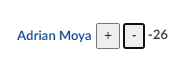
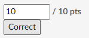

# Canvas TA Tools
This repo contains a set of user scripts that modify certain pages of the Canvas interface to make life easier for TAs. These scripts were designed to be run with [Tampermonkey](https://www.tampermonkey.net/). They should work on any browser that has the extension, and can be imported by opening the extension dashboard and navigating to `Utilities -> Import from File`.

## Discussion Helper
This tool allows TAs to give points to students for participating in discussions.

### Features:
* Give points to students directly on the discussion page
* Save points in hidden a JSON file that stays within Canvas (no PII leak)
* Points are only visible to TAs (must have the script running *and* access to the JSON file)

### Usage

When active, the script will create a toolbar at the top of any discussion page:

And next to each student's name on each of their posts and replies, there will be plus and minus buttons, along with a count of their current score for that discussion:

Currently, the toolbar only has a "Save" button, that will post the points to a JSON file stored in the course's `Files` on Canvas. The button will be enabled when there are unsaved changes.

## Grader Helper
This tool improves the speed with which you can grade Canvas quizzes on the *SpeedGrader* tool. This is specifically helpful for grading fill-in questions.

### Features
* Add a "Correct" button next to questions that instantly gives full credit and saves the update
* Add quick navigation to the next student using arrow keys

### Usage
This is meant to be used in combination with the "Grade by question" feature of the *SpeedGrader*. Enable this by clicking on the gear icon in *SpeedGrader* and checking the box that says "Grade by question (beta)". You may have to refresh once or twice until you see the row of question numbers at the top of the page. This option will keep your viewport scrolled to the correct question as you cycle through students.

The most efficient usage pattern of this tool is to grade on question for all respondents, then grade the next one, and so on, so that you can take advantage of the keybinds without having to scroll.

The script will add a "Correct" button under the score of each question:

Clicking that button will immediately give full credit to the student and click the "Update Scores" button (which saves the action). **Wait until the page refreshes** before moving on, as that will ensure the score was saved.

The script also binds the left and right arrow keys to the next/previous student buttons on the top. So after grading the question, you can move on by just hitting the right arrow key.